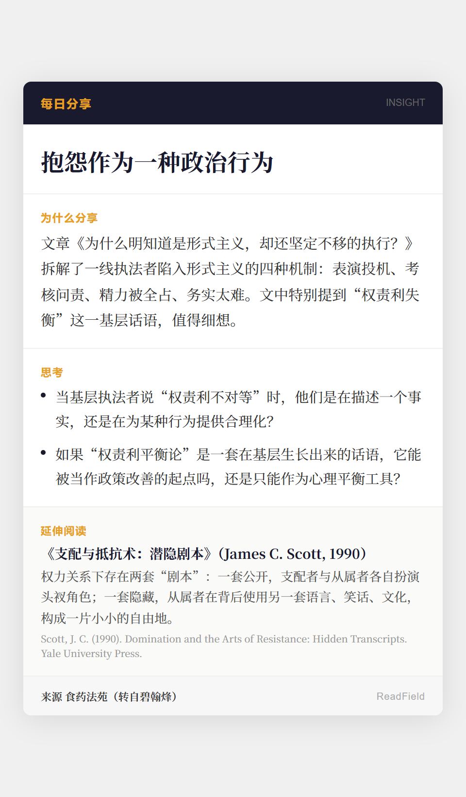

# 每日分享 2026-07-11

## 分享卡

## 分享链接
https://mp.weixin.qq.com/s/oJuhhcH2uZqu4mHryjkqYg

## 内容摘要
- 话题：抱怨作为一种政治行为
- 素材：碧翰烽《为什么明知道是形式主义，却还坚定不移的执行？》（转载自食药法苑）
- 核心关切：基层执法者"权责利失衡"话语到底是事实描述还是行为合理化——如何理解从基层经验中生长出来的话语
- 延伸阅读：James C. Scott，《支配与抵抗术：潜隐剧本》（1990）——public transcript / hidden transcript 两套剧本理论
