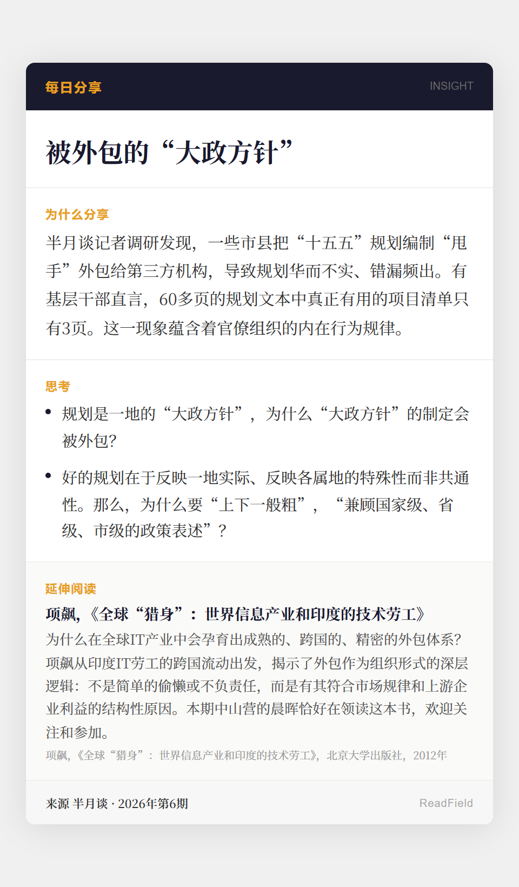

# 每日分享 2026-07-12

## 分享卡

## 分享链接
https://mp.weixin.qq.com/s/3OxTo62vUVKkDVTo90A0pA

## 内容摘要
- 话题：被外包的"大政方针"
- 素材：半月谈（2026年第6期）《"甩手"外包走形式，基层规划浪费大》
- 核心关切：规划是一地的大政方针，为何这种重要政治职能会被外包？基层规划"上下一般粗"背后，反映的是官僚组织怎样的行为逻辑——惩罚性考核压力下的生存策略，还是一种被正式认可的治理模式？
- 延伸阅读：项飙，《全球"猎身"：世界信息产业和印度的技术劳工》——外包作为组织形式的深层逻辑，不是简单的偷懒或不负责任，而是有其符合市场规律和上游企业利益的结构性原因。本期中山营晨晖在领读本书。
